# Standalone Applications Memory Profiling

```

BenchmarkDotNet v0.13.7, elementary OS 7.1 Horus
Intel Core i7-9750H CPU 2.60GHz, 1 CPU, 12 logical and 6 physical cores
.NET SDK 8.0.403
  [Host]     : .NET 8.0.10 (8.0.1024.46610), X64 RyuJIT AVX2
  DefaultJob : .NET 8.0.10 (8.0.1024.46610), X64 RyuJIT AVX2

// * Legends *
Mean      : Arithmetic mean of all measurements
Error     : Half of 99.9% confidence interval
StdDev    : Standard deviation of all measurements
Median    : Value separating the higher half of all measurements (50th percentile)
Gen0      : GC Generation 0 collects per 1000 operations
Allocated : Allocated memory per single operation (managed only, inclusive, 1KB = 1024B)
1 ns      : 1 Nanosecond (0.000000001 sec)

// ***** BenchmarkRunner: End *****
Run time: 00:08:01 (481.37 sec), executed benchmarks: 16

Global total time: 00:09:18 (558.23 sec), executed benchmarks: 16
```
|                                            Method |        Mean |     Error |    StdDev |      Median |   Gen0 | Allocated |
|-------------------------------------------------- |------------:|----------:|----------:|------------:|-------:|----------:|
|         ConstantTemplate_DefaultLogger_Without_If |  36.9356 ns | 0.3398 ns | 0.3178 ns |  36.8560 ns |      - |         - |
|            ConstantTemplate_DefaultLogger_With_If |   7.5069 ns | 0.0907 ns | 0.0804 ns |   7.5172 ns |      - |         - |
|         ConstantTemplate_SerilogLogger_Without_If |   0.8669 ns | 0.0099 ns | 0.0088 ns |   0.8700 ns |      - |         - |
|            ConstantTemplate_SerilogLogger_With_If |   0.0507 ns | 0.0016 ns | 0.0013 ns |   0.0504 ns |      - |         - |
|                                                   |             |           |           |             |        |           |
|     Formatted_DefaultLogger_Without_If_WithParams | 198.4191 ns | 0.8614 ns | 0.8057 ns | 198.0270 ns | 0.0305 |     192 B |
|        Formatted_DefaultLogger_With_If_WithParams |   7.4654 ns | 0.0369 ns | 0.0345 ns |   7.4791 ns |      - |         - |
|     Formatted_SerilogLogger_Without_If_WithParams | 166.2647 ns | 0.9291 ns | 0.8236 ns | 166.1021 ns | 0.0305 |     192 B |
|        Formatted_SerilogLogger_With_If_WithParams |   0.4203 ns | 0.0068 ns | 0.0060 ns |   0.4204 ns |      - |         - |
|                                                   |             |           |           |             |        |           |
|  Interpolated_DefaultLogger_Without_If_WithParams | 139.7757 ns | 1.1509 ns | 1.0766 ns | 140.0550 ns | 0.0203 |     128 B |
|     Interpolated_DefaultLogger_With_If_WithParams |   7.2631 ns | 0.0020 ns | 0.0015 ns |   7.2634 ns |      - |         - |
|  Interpolated_SerilogLogger_Without_If_WithParams |  99.2220 ns | 0.0839 ns | 0.0700 ns |  99.2468 ns | 0.0204 |     128 B |
|     Interpolated_SerilogLogger_With_If_WithParams |   0.7418 ns | 0.0174 ns | 0.0163 ns |   0.7377 ns |      - |         - |
|                                                   |             |           |           |             |        |           |
| Parameterized_DefaultLogger_Without_If_WithParams | 110.1719 ns | 0.1461 ns | 0.1220 ns | 110.1430 ns | 0.0191 |     120 B |
|    Parameterized_DefaultLogger_With_If_WithParams |   7.6346 ns | 0.0179 ns | 0.0150 ns |   7.6336 ns |      - |         - |
| Parameterized_SerilogLogger_Without_If_WithParams |   0.0079 ns | 0.0019 ns | 0.0018 ns |   0.0074 ns |      - |         - |
|    Parameterized_SerilogLogger_With_If_WithParams |   0.7762 ns | 0.0943 ns | 0.2781 ns |   0.8919 ns |      - |         - |

```csharp
public static class Constants
{
    public const int Iterations = 1_000_000;
}

public class CompareEmptyLogsBenchmark
{
    private readonly ILogger<CompareEmptyLogsBenchmark> _defaultLogger;
    private readonly LoggerConfiguration                _loggerConfiguration = new();
    private readonly ILoggerFactory _loggerFactory
        = LoggerFactory.Create(builder => builder.AddConsole().SetMinimumLevel(LogLevel.Warning));
    private readonly ILogger _serilogLogger;

    public CompareEmptyLogsBenchmark()
    {
        _defaultLogger = new Logger<CompareEmptyLogsBenchmark>(_loggerFactory);
        _serilogLogger = _loggerConfiguration.MinimumLevel.Warning().CreateLogger();
    }
}
```


## Constant Template Runs

### Default Logger Checking LogLevel

```c#
public void ConstantTemplate_DefaultLogger_With_If()
{
    if (_defaultLogger.IsEnabled(LogLevel.Information)) 
        _defaultLogger.LogInformation("Fixed Log Message");
}

var compareEmptyLogsBenchmark = new CompareEmptyLogsBenchmark();
for (var i = 0; i < Constants.Iterations; i++)
{
    compareEmptyLogsBenchmark.ConstantTemplate_DefaultLogger_With_If();
}
```

```shell
$ timeit ./Execute.ConstantTemplate.DefaultLogger.WithIf/bin/Release/net8.0/Execute.ConstantTemplate.DefaultLogger.WithIf 
190ms 127µs 245ns
```

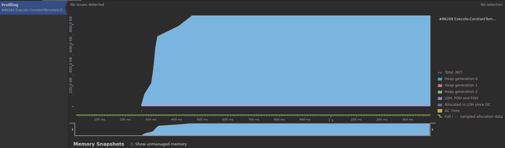

### Default Logger Not Checking LogLevel

```c#
public void ConstantTemplate_DefaultLogger_Without_If()
{
    _defaultLogger.LogInformation("Fixed Log Message");
}

var compareEmptyLogsBenchmark = new CompareEmptyLogsBenchmark();
for (int i = 0; i < Constants.Iterations; i++)
{
    compareEmptyLogsBenchmark.ConstantTemplate_DefaultLogger_Without_If();
}
```

```shell
$ timeit ./Execute.ConstantTemplate.DefaultLogger.WithoutIf/bin/Release/net8.0/Execute.ConstantTemplate.DefaultLogger.WithoutIf 
228ms 753µs 872ns
```


### Serilog Logger Checking LogLevel

```c#
public void ConstantTemplate_SerilogLogger_With_If()
{
    if (_serilogLogger.IsEnabled(LogEventLevel.Information)) _serilogLogger.Information("Fixed Log Message");
}

var compareEmptyLogsBenchmark = new CompareEmptyLogsBenchmark();
for (int i = 0; i < Constants.Iterations; i++)
{
    compareEmptyLogsBenchmark.ConstantTemplate_SerilogLogger_With_If();
}
```

```shell
$ timeit ./Execute.ConstantTemplate.SerilogLogger.WithIf/bin/Release/net8.0/Execute.ConstantTemplate.SerilogLogger.WithIf 
154ms 164µs 306ns
```

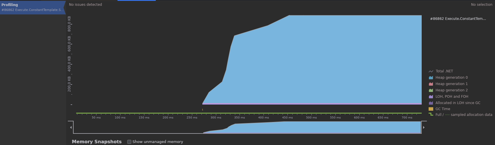

### Serilog Logger Not Checking LogLevel

```c#
public void ConstantTemplate_SerilogLogger_Without_If() 
{ 
    _serilogLogger.Information("Fixed Log Message"); 
}

var compareEmptyLogsBenchmark = new CompareEmptyLogsBenchmark();
for (int i = 0; i < Constants.Iterations; i++)
{
    compareEmptyLogsBenchmark.ConstantTemplate_SerilogLogger_Without_If();
}
```

```shell
$ timeit ./Execute.ConstantTemplate.SerilogLogger.WithoutIf/bin/Release/net8.0/Execute.ConstantTemplate.SerilogLogger.WithoutIf 
153ms 982µs 609ns
```

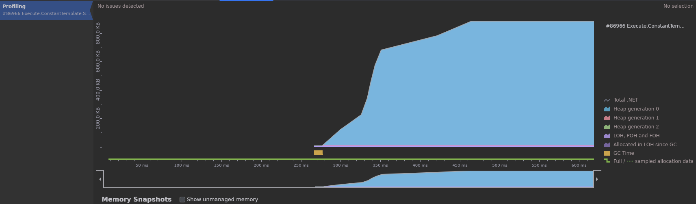


## Parameterized Template Runs

### Default Logger Checking LogLevel

```c#
public void Parameterized_DefaultLogger_With_If_WithParams()
{
    if (_defaultLogger.IsEnabled(LogLevel.Information))
        _defaultLogger.LogInformation("This is a log message with parameters {0}, {1} and {2}", 40, 70, 175);
}

var compareEmptyLogsBenchmark = new CompareEmptyLogsBenchmark();
for (int i = 0; i < Constants.Iterations; i++)
{
    compareEmptyLogsBenchmark.Parameterized_DefaultLogger_With_If_WithParams();
}
```

```shell
$ timeit ./Execute.ParameterizedTemplate.DefaultLogger.WithIf/bin/Release/net8.0/Execute.ParameterizedTemplate.DefaultLogger.WithIf 
190ms 213µs 856ns
```

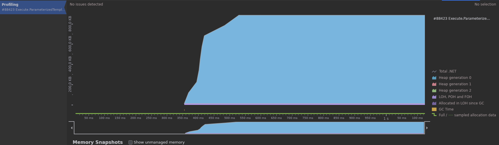

### Default Logger Not Checking LogLevel

```c#
public void Parameterized_DefaultLogger_Without_If_WithParams()
{
    _defaultLogger.LogInformation("This is a log message with parameters {0}, {1} and {2}", 50, 75, 125);
}

var compareEmptyLogsBenchmark = new CompareEmptyLogsBenchmark();
for (int i = 0; i < Constants.Iterations; i++)
{
    compareEmptyLogsBenchmark.Parameterized_DefaultLogger_Without_If_WithParams();
}
```

```shell
$ timeit ./Execute.ParameterizedTemplate.DefaultLogger.WithoutIf/bin/Release/net8.0/Execute.ParameterizedTemplate.DefaultLogger.WithoutIf 
325ms 668µs 9ns
```

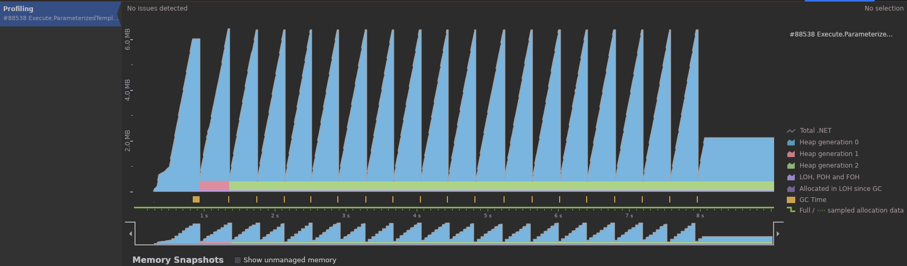

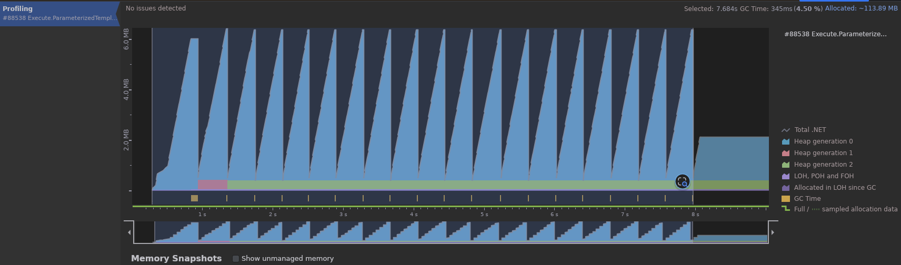

### Serilog Logger Checking LogLevel

```c#
public void Parameterized_SerilogLogger_With_If_WithParams()
{
    if (_serilogLogger.IsEnabled(LogEventLevel.Information))
        _serilogLogger.Information("This is a log message with parameters {0}, {1} and {2}", 40, 70, 175);
}

var compareEmptyLogsBenchmark = new CompareEmptyLogsBenchmark();
for (int i = 0; i < Constants.Iterations; i++)
{
    compareEmptyLogsBenchmark.Parameterized_SerilogLogger_With_If_WithParams();
}
```

```shell
$ timeit ./Execute.ParameterizedTemplate.SerilogLogger.WithIf/bin/Release/net8.0/Execute.ParameterizedTemplate.SerilogLogger.WithIf 
151ms 171µs 873ns
```

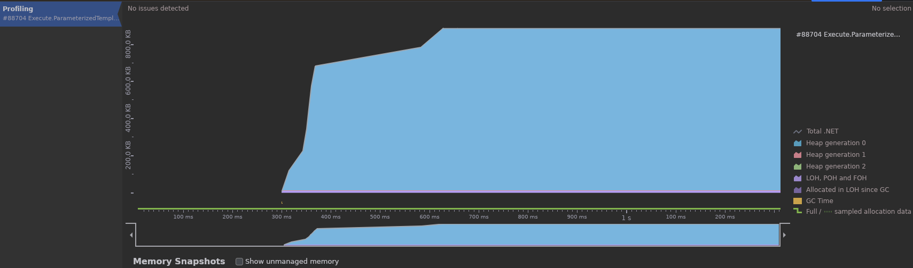

### Serilog Logger Not Checking LogLevel

```c#
public void Parameterized_SerilogLogger_Without_If_WithParams()
{
    _serilogLogger.Information("This is a log message with parameters {0}, {1} and {2}", 50, 75, 125);
}

var compareEmptyLogsBenchmark = new CompareEmptyLogsBenchmark();
for (int i = 0; i < Constants.Iterations; i++)
{
    compareEmptyLogsBenchmark.Parameterized_SerilogLogger_Without_If_WithParams();
}
```

```shell
$ timeit ./Execute.ParameterizedTemplate.SerilogLogger.WithoutIf/bin/Release/net8.0/Execute.ParameterizedTemplate.SerilogLogger.WithoutIf 
157ms 636µs 13ns
```

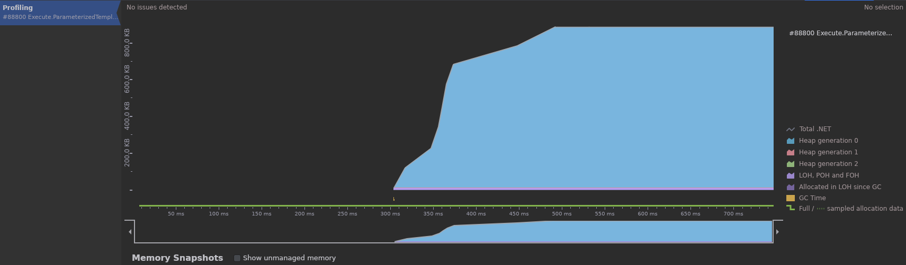


## Formatted Template Runs

### Default Logger Checking LogLevel

```c#
public void Formatted_DefaultLogger_With_If_WithParams()
{
    if (_defaultLogger.IsEnabled(LogLevel.Information))
        _defaultLogger.LogInformation(string.Format("This is a log message with parameters {0}, {1} and {2}", 5, 7, 2));
}

var compareEmptyLogsBenchmark = new CompareEmptyLogsBenchmark();
for (int i = 0; i < Constants.Iterations; i++)
{
    compareEmptyLogsBenchmark.Formatted_DefaultLogger_With_If_WithParams();
}
```

```shell
$ timeit ./Execute.FormattedTemplate.DefaultLogger.WithIf/bin/Release/net8.0/Execute.FormattedTemplate.DefaultLogger.WithIf 
189ms 633µs 888ns
```

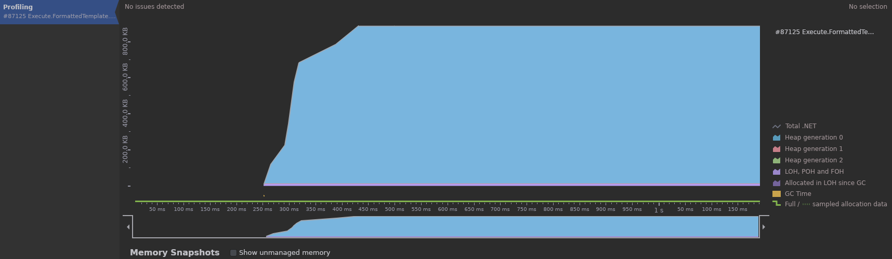

### Default Logger Not Checking LogLevel

```c#
public void Formatted_DefaultLogger_Without_If_WithParams()
{
    _defaultLogger.LogInformation(string.Format("This is a log message with parameters {0}, {1} and {2}", 5, 7, 2));
}

var compareEmptyLogsBenchmark = new CompareEmptyLogsBenchmark();
for (int i = 0; i < Constants.Iterations; i++)
{
    compareEmptyLogsBenchmark.Formatted_DefaultLogger_Without_If_WithParams();
}
```

```shell
$ timeit ./Execute.FormattedTemplate.DefaultLogger.WithoutIf/bin/Release/net8.0/Execute.FormattedTemplate.DefaultLogger.WithoutIf 
496ms 237µs 952ns
```

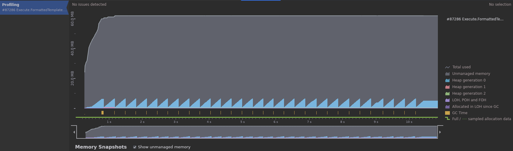

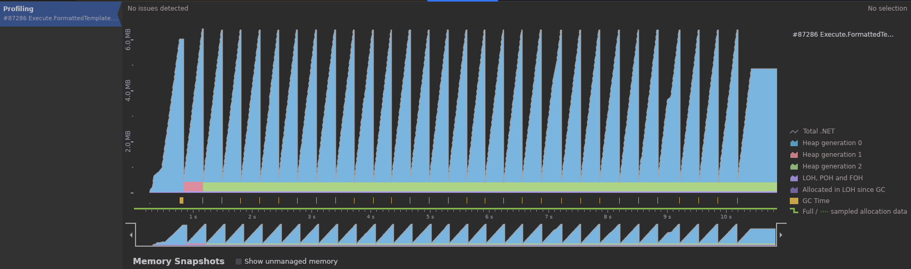

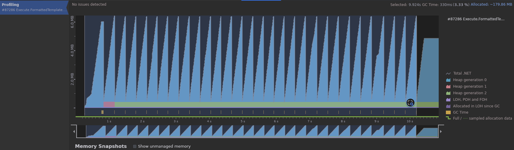

### Serilog Logger Checking LogLevel

```c#
public void Formatted_SerilogLogger_With_If_WithParams()
{
    if (_serilogLogger.IsEnabled(LogEventLevel.Information))
        _serilogLogger.Information(string.Format("This is a log message with parameters {0}, {1} and {2}", 5, 7, 2));
}

var compareEmptyLogsBenchmark = new CompareEmptyLogsBenchmark();
for (int i = 0; i < Constants.Iterations; i++)
{
    compareEmptyLogsBenchmark.Formatted_SerilogLogger_With_If_WithParams();
}
```

```shell
$ timeit ./Execute.FormattedTemplate.SerilogLogger.WithIf/bin/Release/net8.0/Execute.FormattedTemplate.SerilogLogger.WithIf 
152ms 909µs 233ns
```

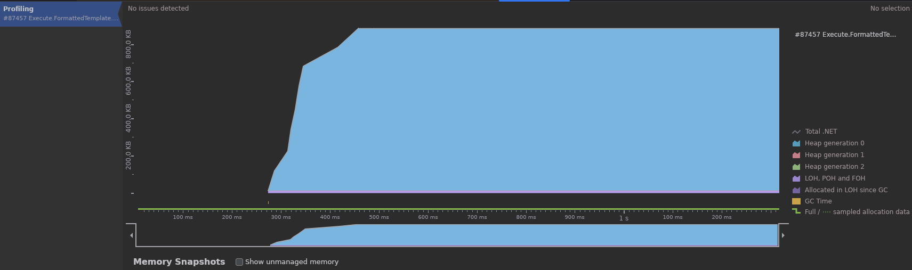

### Serilog Logger Not Checking LogLevel

```c#
public void Formatted_SerilogLogger_Without_If_WithParams()
{
    _serilogLogger.Information(string.Format("This is a log message with parameters {0}, {1} and {2}", 5, 7, 2));
}

var compareEmptyLogsBenchmark = new CompareEmptyLogsBenchmark();
for (int i = 0; i < Constants.Iterations; i++)
{
    compareEmptyLogsBenchmark.Formatted_SerilogLogger_Without_If_WithParams();
}
```

````shell
$ timeit ./Execute.FormattedTemplate.SerilogLogger.WithoutIf/bin/Release/net8.0/Execute.FormattedTemplate.SerilogLogger.WithoutIf 
354ms 197µs 408ns
````

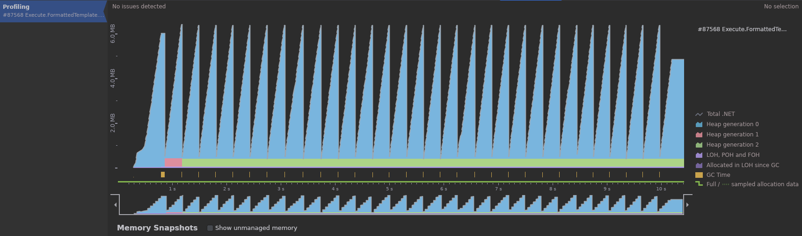

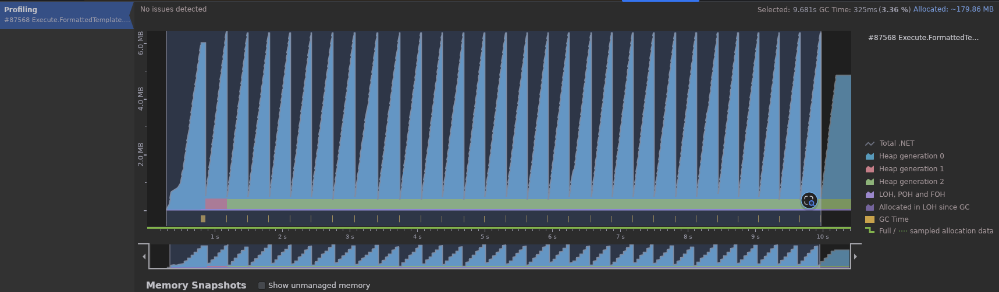

## Interpolated Template Runs

### Default Logger Checking LogLevel

```c#
public void Interpolated_DefaultLogger_With_If_WithParams()
{
    if (_defaultLogger.IsEnabled(LogLevel.Information))
        _defaultLogger.LogInformation($"This is a log message with parameters {464}, {4542}, {0}");
}

var compareEmptyLogsBenchmark = new CompareEmptyLogsBenchmark();
for (int i = 0; i < Constants.Iterations; i++)
{
    compareEmptyLogsBenchmark.Interpolated_DefaultLogger_With_If_WithParams();
}
```

```shell
$ timeit ./Execute.InterpolatedTemplate.DefaultLogger.WithIf/bin/Release/net8.0/Execute.InterpolatedTemplate.DefaultLogger.WithIf 
190ms 567µs 102ns
```

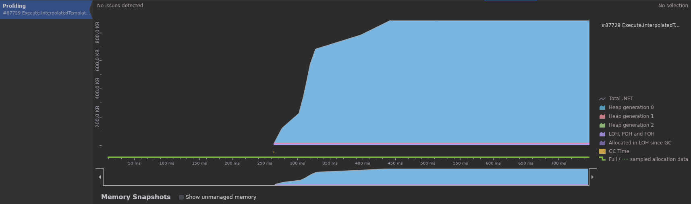

### Default Logger Not Checking LogLevel

```c#
public void Interpolated_DefaultLogger_Without_If_WithParams()
{
    _defaultLogger.LogInformation($"This is a log message with parameters {464}, {4542}, {0}");
}

var compareEmptyLogsBenchmark = new CompareEmptyLogsBenchmark();
for (int i = 0; i < Constants.Iterations; i++)
{
    compareEmptyLogsBenchmark.Interpolated_DefaultLogger_Without_If_WithParams();
}
```

```shell
$ timeit ./Execute.InterpolatedTemplate.DefaultLogger.WithoutIf/bin/Release/net8.0/Execute.InterpolatedTemplate.DefaultLogger.WithoutIf 
453ms 985µs 282ns
```


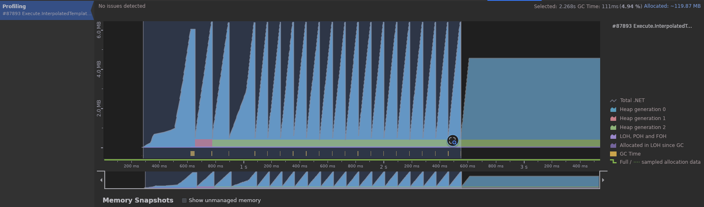

### Serilog Logger Checking LogLevel

```c#
public void Interpolated_SerilogLogger_With_If_WithParams()
{
    if (_serilogLogger.IsEnabled(LogEventLevel.Information))
        _serilogLogger.Information($"This is a log message with parameters {464}, {4542}, {0}");
}

var compareEmptyLogsBenchmark = new CompareEmptyLogsBenchmark();
for (int i = 0; i < Constants.Iterations; i++)
{
    compareEmptyLogsBenchmark.Interpolated_SerilogLogger_With_If_WithParams();
}
```

```shell
$ timeit ./Execute.InterpolatedTemplate.SerilogLogger.WithIf/bin/Release/net8.0/Execute.InterpolatedTemplate.SerilogLogger.WithIf 
150ms 964µs 681ns
```


### Serilog Logger Not Checking LogLevel

```c#
public void Interpolated_SerilogLogger_Without_If_WithParams()
{
    _serilogLogger.Information($"This is a log message with parameters {464}, {4542}, {0}");
}

var compareEmptyLogsBenchmark = new CompareEmptyLogsBenchmark();
for (int i = 0; i < Constants.Iterations; i++)
{
    compareEmptyLogsBenchmark.Interpolated_SerilogLogger_Without_If_WithParams();
}
```

```shell
$ timeit ./Execute.InterpolatedTemplate.SerilogLogger.WithoutIf/bin/Release/net8.0/Execute.InterpolatedTemplate.SerilogLogger.WithoutIf 
321ms 544µs 137ns
```

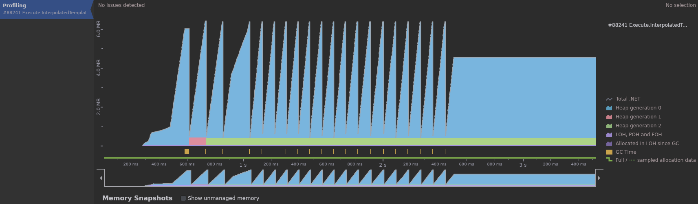

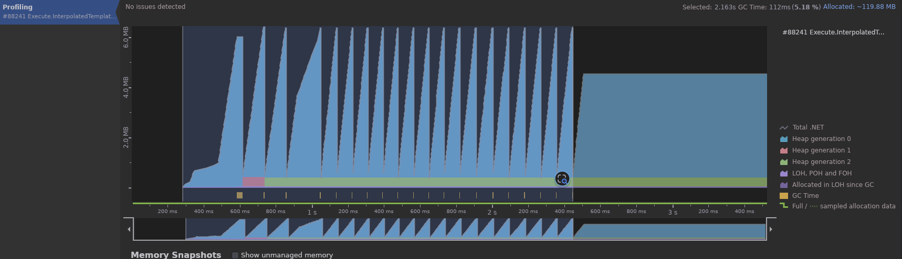
